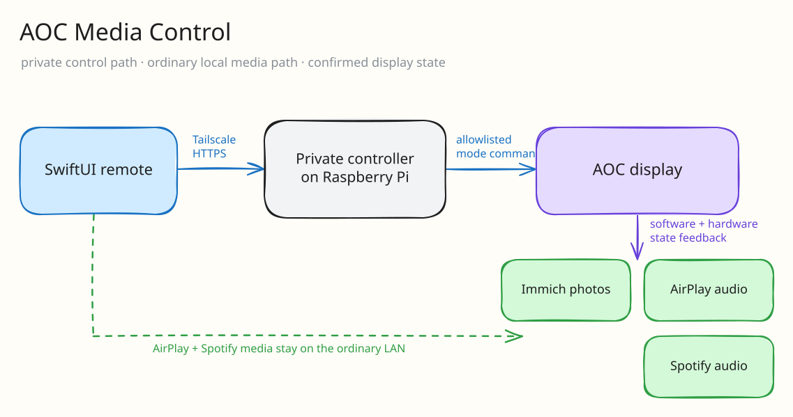

So I had an AOC 16T15 portable monitor and a spare Raspberry Pi 4 lying around. I picked up the 15.6-inch monitor refurbished on eBay for about $30. The listing advertised 220 cd/m² brightness, an 800:1 contrast ratio, and built-in speakers. Nothing fancy, but at that price it felt perfect for a slightly irresponsible Raspberry Pi project.

Originally, I just wanted to use it as an Immich photo frame. This should have been a pretty simple weekend project: run an Immich kiosk in Chromium, plug the Pi into the monitor, and call it a day.

Naturally, I did not call it a day.

I started thinking that since the monitor was already sitting there, it would be nice if I could also AirPlay videos to it. Then I wanted Spotify Connect. Then I wanted a proper iPhone remote so I did not have to SSH into a Raspberry Pi every time I wanted to change modes.

And that is how I ended up making **AOC Media Control**, which is now a native iPhone app, a Go controller in my homelab, a Raspberry Pi agent, and a Docker image containing a frankly stupid number of media programs.

This is the real iPhone app running with its built-in synthetic device status: it prepares AirPlay mode and confirms a monitor mute / unmute without contacting the Pi.



# Version zero: an Immich frame

The basic idea was for the monitor to behave like an actual appliance instead of a Raspberry Pi that happened to have a screen attached to it.

The features are:

1. Immich photo frame as the default mode
2. AirPlay for videos, photos, and screen mirroring
3. Spotify Connect
4. A native SwiftUI remote to swap modes and control playback
5. Health and status reporting so the app does not just lie and say everything worked

I especially did not want a workflow where someone had to paste URLs into a dashboard or know which process to restart. That is acceptable while debugging, but it is pretty terrible as the normal way to use something.

The photo frame was version zero. AirPlay made it version one. Spotify made it version two. The moment I wanted someone else to operate it without knowing what a process was, the remote stopped being optional and the project became an appliance.

# The architecture I backed into

I am still, at heart, a DevOps guy, so naturally this required a control plane.



The controller now runs beside the receiver on the Raspberry Pi. A Tailscale sidecar exposes its HTTPS endpoint only inside my tailnet; it is not published to the LAN or the public internet. The iPhone app sends authenticated commands through that private path, and the controller turns them into a very small allowlisted set of local actions.

The split is less about putting services on different computers and more about separating **control traffic** from **media traffic**. The remote carries commands and confirmed state. AirPlay and Spotify discovery, streams, and audio stay between the phone and Pi on the ordinary LAN.

This was especially important because AirPlay and Spotify rely on local discovery. I did not want to start reflecting mDNS across all of my VLANs and opening random discovery ports because that felt like a networking mess waiting to happen.

The Pi therefore stays on the ordinary LAN with the iPhone. The private controller is reachable through Tailscale, while the receiver uses host networking only where local media discovery requires it.

Honestly, this split ended up being one of the cleaner parts of the project.

# Version three: the receiver owns the machine

This was where things got annoying.

Dockerizing a normal web server is easy because it mainly needs a port and maybe a volume. This container needed:

- host networking for AirPlay and Spotify discovery
- Avahi / mDNS
- HDMI audio
- DRM and video devices for the kiosk and AirPlay video
- input devices
- a way to stop two media players from fighting over the same screen and speakers

The receiver boots as an ARM64 OCI image through Docker Compose. I still keep the normal Raspberry Pi OS installation on the host, but almost all of the actual application lives in the image.

I did this because I really did not want the final deployment instructions to be 40 random `apt install` and shell commands that I would forget six months later. With versioned images, I know what I installed and I can go backward if I inevitably break something.

## One mode at a time

One issue was that every media program assumes it owns the machine.

The photo kiosk wants Chromium and the DRM display. AirPlay wants the display and HDMI audio. Spotify wants audio too. If I just launched everything and hoped for the best, I got exactly what you would expect: processes fighting over devices and the app reporting a mode which was not really working.

I ended up making the modes mutually exclusive. Switching modes is not just changing a frontend state. The Pi stops the previous process, starts the requested one, and then reports the confirmed state back.



That sounds kinda obvious now, but it took me a while to stop treating “the HTTP request returned 200” as proof that a physical display changed modes.

The SwiftUI side therefore waits for the command receipt and checks the returned device state before it changes what the dashboard claims:

```swift
func setMode(_ mode: DisplayMode) async {
    guard let configuration else { return }
    activeTransition = .mode(mode)
    defer { activeTransition = nil }

    do {
        let response = try await client.send(.mode(mode), configuration: configuration)
        let confirmed = try await waitForCommand(
            response.id,
            configuration: configuration,
            timeout: .seconds(35)
        )
        status = confirmed

        if confirmed.mode != mode {
            presentedError = "The Pi did not confirm \(mode.title) mode."
        }
    } catch {
        presentedError = error.localizedDescription
    }
}
```

The important line is not `send`. It is the comparison against `confirmed.mode`.

## Fail loudly on the wrong network

I also added a startup guard which refuses to run the receiver if the Pi is placed on the wrong network.

Is this overkill for one Raspberry Pi? Probably. But I have enough VLANs now that plugging a device into the wrong switch port is a completely realistic mistake, and I would rather have the container fail loudly than quietly run in the wrong trust zone.

# The remote becomes the product

The remote is a native SwiftUI app. It keeps its controller credential in the iOS Keychain and shows the current mode, playback controls, volume, sleep, and health.

This was also my first time making a very hardware-specific iPhone dashboard. Most of the UI was not too bad, but synchronizing it with the actual Pi state was a little annoying. Optimistic UI feels great until the receiver fails to start and the phone still says AirPlay is active.

I now prefer showing the last confirmed state and making transitions visible. It is slightly less magical, but at least it is not fake.



## Designing a remote, not a launcher

The first version of this interface could have been four large buttons. That would have looked clean and been almost useless whenever the physical system disagreed.

The screen now starts with the facts I need before touching anything: whether the Pi is online, which mode it has confirmed, and the most recent hardware readback. Mode changes show a blocking transition instead of immediately recoloring a tile. The display itself shows a local loading screen while one compositor releases DRM and the next one takes ownership, so both sides acknowledge that switching takes time.

I also had to stop calling every slider “brightness.” There are two separate controls:

1. the monitor's hardware backlight through DDC/CI
2. a software dimming and warm-light overlay applied across every media mode

Audio has the same problem. The AOC monitor volume and a Bluetooth speaker are different gain paths with different mute controls. The app only exposes the controls which belong to the selected output, then reads the result back from the Pi. A value shown on the phone is therefore a measurement, not just the last number the user dragged to.

That extra state makes the UI busier than a grid of launch buttons. It also makes it honest enough to operate a real screen.

# What has to ship together

There are actually quite a few separate things to release:

1. controller image
2. Raspberry Pi receiver image
3. Docker Compose stack and private Tailscale identity on the Pi
4. iPhone build / TestFlight

I have made the mistake before of seeing a green build and mentally deciding the entire product is deployed. It is not. A built iOS app does not mean TestFlight is installed, and a published Pi image does not mean the physical Pi is running it.

The tagged images are immutable because overwriting a release tag would make rollback mostly imaginary.

# The hardware gets the final vote

The main thing I learnt is that building an appliance is mostly boundary problems.

AirPlay discovery can work while audio is broken. A container can be healthy while another process owns the display. The iPhone can send a command while the Pi never successfully changes mode. Every component can be “working” by itself and the actual screen can still be blank lol.

I also think the controller + agent split was worth it. It gave me one place to control the device without turning the Raspberry Pi into a public server, while still keeping media traffic local.

Was all of this necessary for a portable monitor? Absolutely not.

But now I have a little Immich photo frame which can turn into an AirPlay display or Spotify player from my phone, and it actually feels like something I built instead of a pile of commands I need to remember.

So I am pretty happy with it :)
