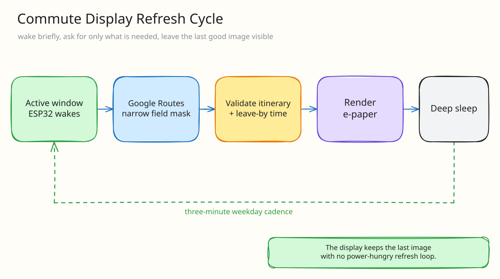

My morning commute has several legs, which means checking one transit app is apparently not enough.

I need to know when to leave home, which train I should catch, and whether that train actually lines up with the final bus. Doing this every morning on my phone was not difficult, but it was annoying enough that I decided to spend significantly more time building a dedicated device instead.

Very reasonable behavior.

The result is an ESP32-S3 commute display using a 2.9-inch black / white / red e-paper panel.

This post follows one refresh cycle: the device wakes, fetches just enough data to make a decision, redraws the paper, and goes back to sleep.

## Why stale e-paper data is dangerous

The screen gives me the next three complete commute options:

1. when to leave home
2. the matching transit line
3. the expected arrival time
4. the last successful refresh time

I show the important times in red because the display only has three colors and I might as well use the exciting one.

The device asks for successive complete transit routes, then subtracts the initial walk from each departure to compute the time I actually need to leave home.



## Fetching three complete commute options

The current build uses the Google Routes API for the complete transit itinerary.

Google's response can be pretty large compared to what an ESP32 actually needs, so I use a field mask and only parse the relevant itinerary data.

The program requests the first route, moves the requested departure time just past that result, and repeats until it has up to three genuinely successive options. It also checks that the response contains a usable transit step before treating the timestamps as a commute.



The actual loop is small because the interesting behavior is encoded in the next departure time, not in a huge response object:

```cpp
https.addHeader("X-Goog-FieldMask",
  "routes.legs.steps.travelMode,routes.legs.steps.staticDuration,"
  "routes.legs.steps.transitDetails");

int fetchOptions(Option out[], int maxN, String& err) {
  time_t after = time(nullptr);
  int n = 0;
  for (; n < maxN; n++) {
    String e;
    Option o = fetchOne(after, e);
    if (!o.ok) {
      if (n == 0) err = e;
      break;
    }
    out[n] = o;
    after = o.depEpoch + 60;
  }
  return n;
}
```

The field mask bounds the JSON; advancing by sixty seconds forces the following request past the route I already displayed.

This was one of those places where microcontrollers make waste very obvious. On a server, downloading a massive JSON response and ignoring 99% of it is merely ugly. On an ESP32, it can just run out of memory and die.

## What actually fits on the 296 × 128 e-paper screen



The display has no scroll view, notifications, or hidden detail page. Whatever does not fit on the 128×296 panel effectively does not exist.

That constraint produced a useful priority order:

1. **Leave-by time** gets the largest type because it answers the immediate question.
2. **Transit line and arrival** sit beside it as enough context to distinguish the options.
3. **Refresh time** stays small but visible so stale data cannot masquerade as current advice.
4. **Urgency** uses the one accent color instead of another icon or sentence.

I render a dedicated diagnostic screen when the route cannot load. Wi-Fi, clock state, and a bounded error message are more useful there than leaving a blank panel. E-paper preserves the last frame, which is wonderful for power and dangerous for trust: without an updated timestamp, a perfectly crisp old commute can look authoritative all morning.

The UI is therefore less like a tiny transit app and more like a physical status report. It shows the decision, the minimum evidence behind it, and whether that evidence is fresh.

## Refresh timing, deep sleep, and debugging

The display refreshes every three minutes during the weekday morning window.

Outside of that schedule, it shows a calm off-hours page and deep-sleeps until the next active period.

This saves power, reduces API calls, and avoids flashing the e-paper screen all night for absolutely no reason.

Errors behave slightly differently. If an API request fails, the device keeps USB debugging available so I can see what happened, then restarts and retries later.

There is also a test mode which fetches once and stays awake. This was essential because trying to debug a microcontroller which immediately goes to sleep is a really good way to lose your mind.

## Hardware and security tradeoffs

The hardware is:

1. ESP32-S3
2. WeAct 2.9-inch black / white / red e-paper display
3. SSD1680 controller
4. 128x296 resolution

E-paper is perfect for this because the screen keeps the last successful result visible without constant power. It also does not glow or animate, which forced me to keep the information simple.

The repository contains placeholders for Wi-Fi, API keys, and the home address. None of those values are committed.

One security compromise is still documented: the current hobby build disables TLS certificate verification for the API calls. The better version should install and maintain the correct root certificates.

It is not ideal, but hiding the problem inside the code would not make it safer. At least it is very clearly listed as something I need to fix before pretending this is a hardened device.

## Why I built a display instead of opening another app

Yes, I could look at my phone.

But the nice part about this screen is that it is ambient. I can glance at it and immediately know whether I should leave now or whether I have time to continue drinking coffee.

I think smart displays are usually filled with way too much information. The actual work in this project happens behind the scenes so the final screen can show less.

Three commute options. One decision. No app to open.

Honestly, this might be one of the most practically useful tiny things I have built.
