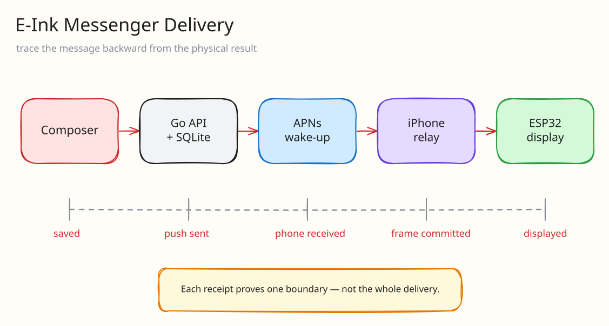

I wanted to make a small display where someone could send text and drawings from their phone and have it appear beside the other person.

That was the cute and simple idea.

The actual implementation somehow became a Go server, a SwiftUI app, APNs, Core Bluetooth, ESP32 firmware, two different display backends, a browser client, image rendering, recovery codes, widgets, and a delivery state machine.

So yeah, **E-Ink Messenger** ended up being a lot more complicated than I expected.

The easiest way to explain it is not by listing features. It is to take one drawing that supposedly arrived and walk backward through every system which had to make that statement true.

Here is the real composer flow running in an isolated iOS simulator with synthetic content:



# Reconstructing one delivery

The full message path is:



The recipient iPhone acts as the relay between the server and the display.

I could have made the ESP32 poll a public API directly, but then the display would need internet credentials, more complicated auth, and enough logic to understand the entire application. Keeping the ESP32 behind BLE felt much safer and also made the firmware smaller.

The server stores the message, sends a content-free APNs notification, and the recipient phone renders the correct frame for its paired display. The iPhone then transfers the frame through BLE to the ESP32.

Sounds simple enough when written in one paragraph.

It was not.

# The trace used to stop too early

One of the most annoying bugs was that a message could say `push_sent` forever and only appear after pressing **Retry pending message**.

At first, it was tempting to assume BLE was broken. However, the manual retry worked, which proved that the payload, the phone, the Bluetooth link, and the display were actually capable of completing the transfer.

The real unreliable part was waking the iPhone in the background.

I ended up splitting delivery into several explicit states:

```text
push_sent -> phone_received -> frame_committed -> displayed
```

Each state means something different:

1. Apple accepted the background push
2. The iPhone actually received it
3. The complete frame was transferred
4. The display acknowledged and showed it

The server makes that monotonic rule explicit instead of trusting receipts to arrive in order:

```go
allowed := map[string]int{
	model.StatusPhoneReceived:  1,
	model.StatusFrameCommitted: 2,
	model.StatusDisplayed:      3,
}

// Duplicate or late receipts must never move a message backwards.
if allowed[m.Status] >= allowed[status] {
	return m, tx.Commit()
}

column := map[string]string{
	model.StatusPhoneReceived:  "phone_received_at",
	model.StatusFrameCommitted: "frame_committed_at",
	model.StatusDisplayed:      "displayed_at",
}[status]
```

A duplicate `phone_received` after `displayed` becomes a no-op instead of rewinding the message.

APNs background pushes are best-effort. Low Power Mode can disable Background App Refresh, iOS may decide not to wake the app, and having the phone physically beside the display does not mean the process is running.

This kinda sucked because I wanted the display to magically update unattended. Unfortunately, I cannot bully iOS into making guarantees it does not make.

The recovery path is therefore very explicit: open the app, let BLE reconnect, or retry the pending message. At least the UI can now explain exactly where the message stopped instead of showing one meaningless checkmark.

# At the far end: two incompatible displays

The original target was a 2.9-inch black / white / red e-paper display.

Later, I also added a 2.8-inch ILI9341 color LCD at 320x240. I first tested the screen using a completely separate breadboard sketch because I did not want to debug my renderer, BLE protocol, firmware, and wiring simultaneously.

This was also where I nearly connected to a pin which was not actually ground. Thankfully, I checked the printed labels and wiring before powering it, which is probably the only reason this section is not about how I killed an ESP32.

## One document, two frames

The displays behave very differently.

The e-paper panel only has black, white, and red, refreshes slowly, and keeps its image without continuous power. The ILI9341 is a normal color LCD, so I render a dithered 64-color RGB222 palette while preserving the named drawing colors.

I kept a common document model above both backends. Text, strokes, and photos are composed once, and the renderer converts the result into the exact frame required by the paired display.



Photo metadata is stripped during conversion. Images are fitted with white letterboxing instead of randomly cropping out someone's face, which happened enough times that I had to fix it properly.

# Back at the start: authoring intent

The first editor was basically just a drawing canvas.



The demo at the top shows the current composer opening canvas settings, choosing a starter layout, and entering the delivery preview.

Then I added:

- zooming
- camera and photo imports
- multiple movable and resizable photos
- multi-stroke selection
- message history
- full-screen saved message previews
- favorite drawings
- a randomized favorite carousel for the display
- recent-message and streak widgets

The hardest part of these features was not usually rendering them. It was keeping the exact same document stable while the user zoomed, moved things, imported another image, reopened history, or rendered it for a completely different display.

I think making visual editors is one of those things that seems easy until you have more than one coordinate system. Then everything starts drifting for reasons which feel personally targeted.

## The canvas knows its destination

The editor cannot be a generic white rectangle. It needs to represent the display which will receive the message.

The paired display profile determines the canvas aspect ratio, logical resolution, supported colors, and final renderer. A black / white / red e-paper partner should not let me design around colors it cannot reproduce. A 320×240 LCD should not pretend it has the same proportions as the narrow e-paper panel. The UI therefore shows the active display profile and derives the drawing palette from it.

The editing surface also has three jobs which are easy to confuse:

1. manipulate the document without losing its logical coordinates
2. preview how a particular display will interpret it
3. explain whether the document is actually ready to send

Undo and redo belong to the document. Zoom belongs to the viewport. Moving and resizing a photo changes the document, but pinching the canvas does not. Keeping those layers separate prevented a whole class of bugs where reopening a message subtly changed its layout.

Sending moved into its own sheet because delivery is not an editor toolbar detail. That surface can show the destination, schedule, connectivity, and result without covering the artwork with transient banners. The **Send** action is disabled when there is no artwork or another operation owns the client. Once the message leaves the editor, the receipt state machine takes over.

This is the part where the UI and protocol finally meet: the composer describes intent, while delivery status describes evidence.

# What happens when a client disappears

I also made a linked browser composer.

The phone creates a one-use link which expires after a short time. Redeeming it creates a separate browser session with an expiring secure cookie. The browser never receives the iPhone's native bearer token, and the browser session can be revoked independently.

This was important because sharing one credential between every client is convenient right until a laptop or phone gets lost.

Phone recovery works similarly. An active partner can create a one-use replacement code which rotates only the lost phone's session while keeping the shared space and message history.

There is also a local reset when the server is down, although the app very clearly warns that it cannot revoke the old server session until connectivity comes back.

Honestly, recovery flows are boring to demo but they are what makes the app feel like something I can actually keep using.

# The final untested wire

The firmware sleeps the display after 30 minutes and resets the timer whenever a valid message or retry completes.

E-paper is amazing here because the image remains on screen while the controller hibernates. The LCD controller can also enter sleep, but there is one funny hardware problem: if the backlight is wired directly to 3.3V, it stays lit anyway.

Software can put the controller to sleep. Software cannot magically rewire the backlight.

To make the LCD fully dark, I still need a safe transistor / MOSFET controlled backlight circuit and a proper physical observation test. I am leaving that boundary honest instead of claiming that a passing firmware test proves the room is dark.

# “Delivered” is a physical fact

I originally thought the difficult part would be rendering a drawing on an ESP32 display.

It turns out the difficult part was knowing whether the drawing actually reached the other person.

APNs accepting a push does not mean the phone received it. The phone receiving it does not mean BLE finished. BLE finishing does not mean the display committed the frame.

I had to make every one of those boundaries visible before the system started feeling reliable.

This is probably the most complicated route I could have chosen to send a cute little drawing to someone, but seeing the exact same picture appear on a tiny physical screen is still incredibly satisfying.

Worth it hehe.
