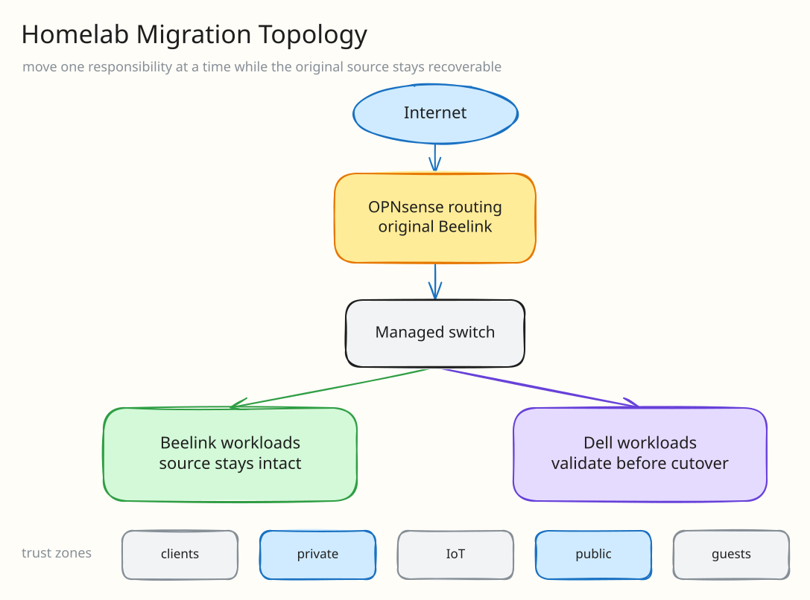

My [previous homelab article](/posts/homelab-showcase/) ended with two Kubernetes clusters, several LXCs, and one mini PC doing compute, storage, and routing at the same time. Part 2 is the work I did to add a second Proxmox host without pretending the first host was disposable.

The plan was simple on paper: keep the original machine as the router and storage server, move more compute to the Dell, and separate public workloads from private ones with VLANs and OPNsense rules.

The implementation involved a VM move, a shared-storage path, an off-machine Kubernetes checkpoint, a switch trunk, an address-conflict probe, one failed network cutover, a complete rollback, an isolation test, and a backup verification. This is the actual sequence.

# The architecture I built

I added the Dell as a second Proxmox node and connected it to the managed switch. The original mini PC still runs OPNsense and exports the shared storage used by the Dell-hosted VM, so it remains a real dependency rather than an “old server.”

The switch carries separate networks for ordinary clients, private infrastructure, IoT devices, public workloads, and guests. The access point serves multiple SSIDs across those networks. Their management interfaces live in only one trust zone each; that does not describe every VLAN they carry.





At this stage the topology was deliberately asymmetric: the Dell could run workloads, but the original host still owned routing and storage. That dependency determined what I could safely move and what I had to preserve.

# I moved the public cluster's compute first

I restored the public single-node Kubernetes VM onto storage shared by the two Proxmox hosts, then ran that VM on the Dell. The original virtual disk and VM configuration stayed on the first host as the rollback source.

The post-move checks were more important than the VM appearing in the Dell's inventory:

- both Proxmox nodes were online and quorate
- the VM was running on the Dell from the shared virtual disk
- the Kubernetes node reported `Ready`
- the guest agent reported the expected interface and route
- the virtual disk reported no failed reads, writes, flushes, or unmaps
- the original disk remained separate and untouched

That gave me a working compute move with a recoverable source. It did **not** complete the network move.

# I made recovery material before touching the network

The public cluster uses embedded etcd, so before changing its address I created an etcd snapshot inside the VM. I copied that snapshot off the VM, locked the copy down to the root account, and compared its checksum and byte count with the original.

I also saved the active VM configuration and the guest's network configuration before the cutover attempt. I generated the proposed configuration in an isolated directory first instead of editing the only working copy in place.

The recovery checkpoint therefore covered three different failure modes:

1. the Kubernetes datastore could be restored from the verified snapshot
2. the VM's virtual hardware configuration could be reconstructed
3. the guest could be returned to its previous address and route

Kubernetes was still `Ready` after the checkpoint was created and copied.

# I tested the destination address before using it

Before the service interruption, I created one temporary VLAN interface on the Dell and used duplicate-address-detection probes against the proposed address. Nothing answered, which gave me evidence that the address was not already in use.

I removed the temporary interface immediately afterward and confirmed the running VM had not changed. The test answered one narrow question—address conflict—and did not claim that routing, DNS, or the firewall were ready.

# The VLAN cutover failed, so I rolled it back

For the guarded cutover attempt, I stopped Kubernetes cleanly, changed the VM's virtual NIC to the public-workload VLAN, and applied the prevalidated guest configuration.

The guest acquired the intended address and default route, but it could not reach the gateway. Internet egress and DNS therefore failed too. I stopped at that gate instead of starting Kubernetes in a half-working network.

I restored the saved guest configuration, restored the original virtual NIC assignment, and applied the old network state. The VM returned to its previous address, Kubernetes started successfully, the node returned to `Ready`, and the shared disk still reported zero I/O failures.

The rollback was not cleanup after the “real” work. It was part of the work.



# I found the actual network blocker

The switch and the Dell bridge were carrying the public VLAN correctly. The missing link was on the original host: the public network existed on an isolated software bridge, while the physical switch trunk terminated on a different bridge.

In other words, the VLAN frames arriving from the Dell had no path to the router interface that owned the public gateway. This was not a bad Kubernetes manifest, a stale DNS record, or an application problem. It was a Layer 2 topology gap.

Fixing it requires a deliberate bridge or OPNsense VLAN redesign. I left that change out of the failed attempt because it expands the blast radius from one workload to the network used by every public service.

# I tested the private-cluster design separately

The private cluster has different requirements because its persistent data and administrative services must not become reachable from the public-workload network.

I inventoried the source VM, Kubernetes datastore, persistent volumes, routes, memory pressure, disk allocation, backup state, and Dell capacity. That inspection found the private cluster healthy on the original host, with its persistent volumes contained inside the VM's main disk.

I then tested the proposed Dell network boundary with a disposable empty network namespace. The native private path could reach its gateway, while guest-generated traffic tagged for the IoT and public networks could not resolve either gateway. The probe was removed after the test.

From the public cluster I also tested representative private destinations and service ports; they were blocked. The private side retained its required DNS and internet egress. This gave me data-plane evidence for the isolation design, although I still want matching firewall-log evidence before a private-cluster cutover.

# The backup passed; the disk copy did not

Before moving the large private VM, I created a consistent online copy of its Kubernetes SQLite datastore, ran an integrity check, and recorded a checksum. I also created an encrypted Proxmox Backup Server recovery point.

I did not count the backup as good just because it existed or showed an encryption badge. I checked the exact snapshot row and waited for the verification result to report `OK`.

The later disk-copy attempt failed with a broken pipe. It left a large raw file on the shared storage, but that file was unattached and had not passed a consistency check. The production VM was still running from its original disk.

So I treated the copy as failed. I did not attach it, promote it, overwrite the source, or describe the private workload as migrated. A full-sized file is not proof of a valid virtual disk.

# What is actually complete



| Work item | Result |
| --- | --- |
| Add the Dell as a second Proxmox compute host | Complete |
| Run the public Kubernetes VM on Dell-backed shared storage | Complete |
| Preserve the original public VM disk and configuration | Complete |
| Create and verify an off-VM etcd checkpoint | Complete |
| Probe the proposed public address without changing production | Complete |
| Move the public VM onto its final network | Rolled back after the gateway check failed |
| Identify the failed network path | Complete: the public bridge did not reach the physical trunk |
| Prove the proposed private access-mode isolation | Complete at the data plane; firewall-log correlation remains |
| Verify an encrypted recovery point for the private VM | Complete |
| Copy and cut over the private VM | Not complete; the copy failed and the source remains authoritative |

The Dell now does real work, but the migration is intentionally incomplete. The original host still routes the network, exports shared storage, and owns the authoritative private-cluster disk. The public cluster's final VLAN move needs a network redesign, and the private cluster needs a new copy strategy plus the remaining isolation checks.

That is less satisfying than a clean “everything migrated” ending, but it is the accurate state of the homelab—and I still have a rollback path.
