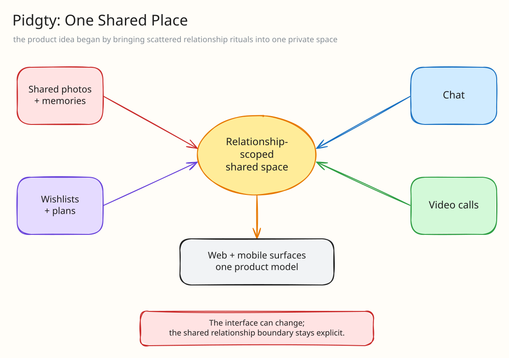
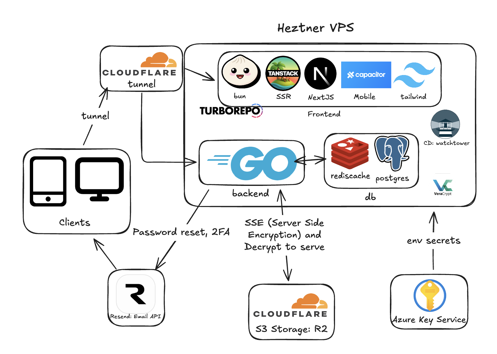
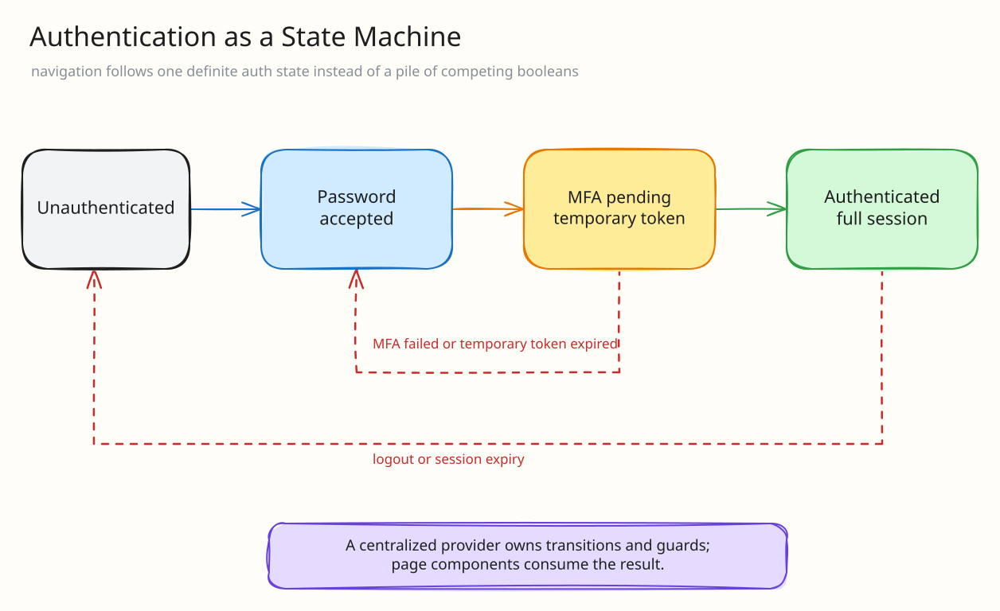
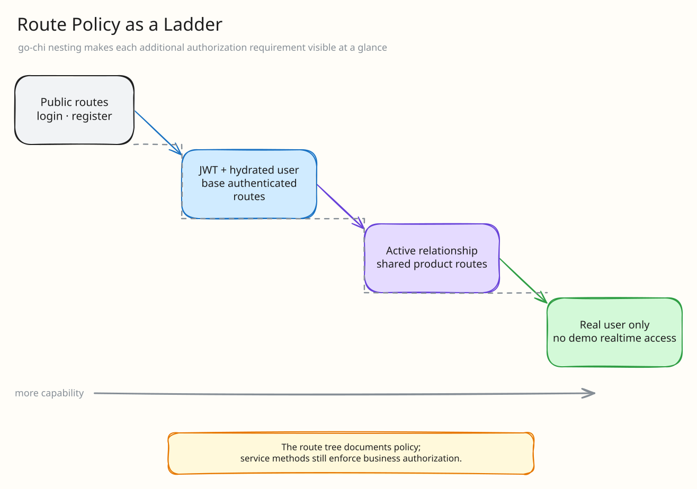
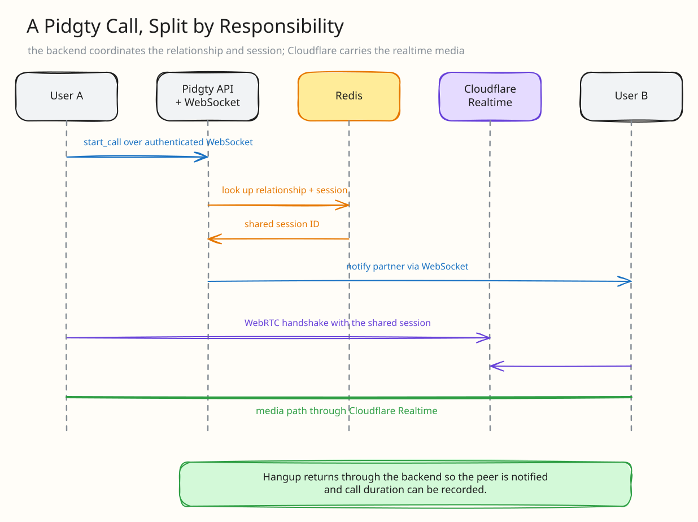

Check out the webapp here: https://pidgty.com/

Mobile app is under review xoxo

Here is the real web UI running against Pidgty's reset Alice/Bob demo data.



# Introduction - pidgty.

pidgty. is a love child that I spent the last 1-2 months dedicating my life to. Before I started my career proper at TikTok, I wanted to create something that I could call my own, since I probably wouldn't have the time to do so when I started working. In many ways,  this was also a great way for me to hone my coding skills before I started working as a full time backend SWE.

I recently got a girlfriend (hey poopoo), and I guess that's how the idea for this app arose. We mainly texted on telegram and it was getting bothersome to have all of our pictures on iphone's shared albums, our wishlists on a pinned message on our telegram chat, and our calls over facetime. That got me thinking.

What if we could have all of these in one app?



The demo at the top follows that shared product space through home, chat, calendar, and diary.

# Technical Overview - Infrastructure

I am still, at heart, a DevOps guy. Naturally, I start with how a diagram on how everything links together on a higher level.



I think some of the more interesting frameworks that I had to work with were Cloudflare R2, as well as Cloudflare Realtime (Serverless SFU) for video calling.

Capacitor and mobile dev was honestly also very interesting to learn, but it was a pain and I'm still not sure if I should've chosen to rewrite everything from scratch in react native.

Besdies that, I have also never gotten in depth with frontend, so SSR via tanstack was also something which was new to me!

I settled on Cloudflare R2 because it was cheap and also because it doesn't charge on egress like AWS S3 does. While its probably true that companies are locked-in or have deals for cheaper services, a lone developer like me benefits much more from services like Cloudflare R2.

---

# Technical Overview - Security:

Security was of utmost importance to me while making this app. This is because this was an app which was going to be of user's most private data of their relationships, and I did not want user data to leak.

That being said, this was pretty much the only project I've ever done where I was solely responsible for the security of user's data. This meant that I had to both learn and carefully implement security, which was no easy task.

One of the first problems that I faced was deciding how my app was going to be authenticated. Here, I chose JWTs.

## Auth: JWT (JSON Web Tokens)
I used both HttpOnly cookies as JWT (this is for the web), as well as capacitor's preference storage, in order to keep cookies for the user on the mobile phone.

This was the main mechanism in which sessions and logging in and identification was carried out. With the new white paper by google on [quantum computing](https://quantumai.google/static/site-assets/downloads/cryptocurrency-whitepaper.pdf), it seems like JWT might not really be secure in the future, but oh well.

On login, the users will be handed a JWT from the server which would only last a set number of hours. This allowed them to stay logged in via the JWT in their cookie store.

Frontend: The JWTs would then be attached via axios intercepter as a auth-token.

Backend: These JWTs would go through an auth middleware, which decrypted the token and checked the user for every single API call that was made to the server. With how JWT's work, if the decryption wasn't correct, then we will reject the request with 403 unauthorized. Additionally, If the JWT had already expired, then they would be reissued a new JWT.

Making and creating the JWT was honestly not too hard with the [Go libraries]("github.com/golang-jwt/jwt/v5") that supported JWT. What was extra challenging was the Auth process required.

## Auth: MFA (Multi Factor Authentication)

Now, this was something which was completely new to me and was very difficult to wrap my head around. One of the main learning points I had from this experience was that making the decision to have MFA should be done early and planned around.

MFA was done by giving the user a temp token, in a "half logged in" state after they have successfully completed the password check.

Before my final build, there was a point where I did not have MFA built. Subsequently, as I tried to incorporate MFA, my frontend Auth Provider was getting extremely complicated and messy, with many different callbacks and states checking to see if the user had already passed through the password stage, and whether they are unauthenticated, or fully authenticated. This was a mess and caused a lot of complexity in my code, and made it almost impossible to trace the data flow.

Worst of all, with how my navigation guard was working in my Auth Provider, it was actively freaking out with states being kept everywhere.

To combat this, I rewrote most of the authentication to be centralized in the Provider, such as logins, logouts, registers, 2fa_pending etc. This ensured that the components were "dumb" and the provider had control of all the user states. Additionally, I used implemented the nav guard as a state machine with definite states that the user could be in, instead of checking if multiple callback states were true. This helped simplify my code a lot, and is definitely something that I will keep in mind in the future when designing future code solutions.



Honestly, if i were to rewrite this, I would use stuff like [Zustand](https://github.com/pmndrs/zustand) or Redux. Unfortunately, my inexperience with frontend just meant that I didn't know about these when I first started building out my frontend.

Auth Provider aside, I think it was also fascinating how there were a lot of resources already available for devs to take advantage of, instead of relying on pre-built solutions like supabase, or dokku or coolify. For example, the email provider I used, Resend, gives 3000 free emails a month, which is probably more than enough for what I need.

TLDR:
- state machines simplify complex if else checking
  - Zustand or Redux are great at state management
- keep components dumb, centralize logic into one file or domain
- Frontend-as-a-service or Backend-as-a-service is probably good if youre short on time, but learning to implement it myself taught me so much more. (and cheaper)

## Encryption: SSE-C (Server-Side Encryption with Customer Provided Keys) versus normal SEE on Cloudflare R2

There's always been a tradeoff between privacy and efficiency. I feel that while I did initially have the code written for SSE-C, it turns out that the latency trade off due to the active handling of decryption was just too painful in terms of latency. Sucks, but I did try though :(

## Data - Postgres

There is still sensitive data lying on my postgres. For one, the emails, and chat logs and call histories of all users are logged and stored in my PSQL that is on my heztner VPS. This means that it had to be stored securely.

Since my stack was being ran by docker compose, I chose to use bind mounts and have these bind mounts be stored in a [veracrypt](https://veracrypt.io/en/Home.html) container on my server. With almost everything being done by a separate user from root, the Veracrypt could only be unlocked by root itself or a sudoer. This also means any random snapshot cannot be read.

Additionally, SSH access into the VPS is with a RSA key (or was it ed25519?), and I actually mainly use my own private tailscale vpn mesh for access, which is protected by Authentik as an OIDC. See more of my vpn mesh in [my homelab article](https://blog.seanchoo.dev/posts/homelab-showcase/).

The passwords are salted and hashed by bcrypt, and honestly, with the MFA, it's probably already good enough since attackers can't really brute force MFA lmfao.

For another layer of security, Cloudflare already does their WAF (web application firewall), so ratelimiting is also actually controlled there via a rule. If they wanna run a botnet on me, i guess ill die

## Cloud Secrets - Azure Key Vault

ah... My one true love, azure key vault which only charges me less than $0.10 USD per month for all my keys. I'm pretty sure AWS has like a $1.00 flat fee (yikes) and $0.40 per secret? (double yikes)

With how my application was built, all of the env vars are injected in runtime and subsequently parsed by [viper](https://github.com/spf13/viper), a configuration manager. I used the Azure SDK, which relies on credentials that are chmodded and stored on veracrypt, and mounted & passed it before uber/fx invoked.

This meants that I won't have any env vars lying around on my server for people to attack.


---

Alright, that was a lot about security, so let's dive into the backend:


# Technical Overview - Backend

## Dependency Injection

I used a runtime Dependency Injection Framework. When choosing between [uber-go/fx](https://github.com/uber-go/fx) and [google/wire](https://github.com/google/wire), I settled on uber/fx because google/wire had been deprecated, although I don't see much activity on uber/fx.

This was a huge lifesaver and honestly a great practice, since I saved a lot of mindless wiring that I would've needed to do myself. Frankly, I would recommend doing this for almost any project, no matter how big or small, because it saved on a good amount of brainless boilerplate code.

## Domain-Driven Development (DDD)
Since this was my first project which would grow to be so massive, I decided that I had to follow some sort of structure, and I chose the philosophy of Domain-Driven Development (DDD). For a reference, I followed the structure found in [apache/answer](https://github.com/apache/answer). This meant that I had:
1. Controller - Web facing, HTTP handling and JSON parsing
2. Service - Application Layer and logic
3. Repo - Data responsibilities

For a rough outline:
``` bash
tree . -L 2

.
├── backups
├── cmd
│   ├── main.go
│   └── providers.go
├── config
│   └── config.yaml
├── Dockerfile
├── frontend
├── internal
│   ├── base
│   ├── controller
│   ├── entity
│   ├── repo
│   ├── router
│   └── service
└── Makefile
```

## Controller Layer

Following in the [apache/answer's](https://github.com/apache/answer) structure, which was a great example of the DDD, the controller layer was done to only handle mostly json encoding and decoding, as well as a middleware check on every single API call to guarantee AuthN.

## Service Layer

Probably where most of the AuthZ was at, while also the core of the business logic.

## Repo Layer

Gorm's Automigrate was also a great life saver, since it helped me create all the tables without me writing a single line of SQL. In fact, I think I didn't write a single line of SQL at all! Everything was done via gorm in my repo layer.

## Reflections on Domain-Driven Development (DDD):

When the project first started, it was definitely tempting to just place everything into a god class with all of the functions being placed into a single controller or a single service. However, as the project soon grew, the benefits of this sort of structure was immediately obvious.

- Debugging was infinitely easier because I had a good sense of where certain tasks were being executed, and tracing the bugs was definitely much quicker thanks to a strict demarcation of where certain logic should lie.
- Cross repo or cross service calls were much more intuitive and compartmentalized. While it was certain to have been a benefit from this sort of design, it was just so exciting to see that I could readily call the repo of a separate domain and reap the benefits without having to deal with DRY-ish code.
- Probably unsuitable for a small project spanning 3-4 files, but for a codebase of my size, it was a worthy investment. I will keep this in mind for future projects I make too!


## Entities / Classes:

I think theres something to be said about entities and classes. I know every single CS class in college probably emphasizes the importance about OOP, but it's difficult to see the effects of employing OOP unless the same object is being used at 20 different places. Because of the scale of this project, I got to see the full impact that OOP would have.

Instead of it being just a simple placeholder holding all of my data under a single name, it provided an insane amount of reliability. Just knowing that these fields would all be present from a repo call made a lot of my other service functions flow like butter. It was pretty difficult to see the full effects of this in my small scale school projects or other projects.

## go-chi and Routing

Apparently, [go-chi](https://github.com/go-chi/chi) is very close to http, but with sufficiently built abstractions that it served as very important in my routing strategy.

``` go
r.Route("/api/v1", func(v1 chi.Router) {

    // Group A: Unauthenticated Routes (Login)
    v1.Group(func(unAuth chi.Router) {
        a.apiRouter.RegisterUnAuthAPIRouter(unAuth)
    })

    // Group B: Authenticated Routes (Memories, Calendar, Uploads)
    v1.Group(func(auth chi.Router) {
        auth.Use(middleware.JWTAuth(a.authCfg.JWTToken))
        auth.Use(middleware.HydrateUser(a.authService))

        // 1. Base Auth
        a.apiRouter.RegisterBaseAuthRouter(auth)

        // 2. Base Auth + Real User
        auth.Group(func(realBase chi.Router) {
            realBase.Use(middleware.RequireRealUser)
            a.apiRouter.RegisterBaseAuthAndRealUserRouter(realBase)
        })

        // 3. Base Auth + Active Relationship
        auth.Group(func(active chi.Router) {
            active.Use(middleware.RequireActiveRelationship)
            a.apiRouter.RegisterActiveRelationshipRouter(active)

            // 4. Base Auth + Active Relationship + Real User
            active.Group(func(realActive chi.Router) {
                realActive.Use(middleware.RequireRealUser)
                a.apiRouter.RegisterActiveRelationshipAndRealUserRouter(realActive)
            })
        })
    })
})
```

With this added layer of grouping of api routes, it allowed for immensely easy to understand policy application for different routes. Controlling routes using middleware at this detail was something that I had never really encountered before, but it was just so satisfying to be able to apply policies and middleware requirements at a glance. The fact that each group could have subgroups made it amazingly clean.



## Redis Cache

I originally started off with a simple cache, like the one used in [go-cache](https://github.com/patrickmn/go-cache) that was just in-memory and an easy key-value store.

However, as my project grew in complexity, and I needed pub/sub features, such as a mailbox system for users to see past notifs that were sent and missed since their time of login, I switched over to Redis. This also gave it more survivability in the event of a sudden shutdown event.

## Video Calling Cloudflare Realtime (Serverless SFU & TURN):

When I asked my friends to try out one of the first few versions of my app, I think that one of the main feedbacks that I got was that they wanted a chat function as well as a video call function, so that if both parties are on the app they could talk to each other. This would make the app more inclusive.

That's where I got the idea to implement Cloudflare Realtime, which gave free data transfer of 1,000 GB / month. I was considering other solutions such as [Mirotalk](https://github.com/miroslavpejic85/mirotalk)? While it would be fine, it just seemed a little too bloated for my liking, with a lot of excessive features which I did not want to use but would take up my RAM.

Additionally, self hosting Mirotalk would mean that I would not have access to the fast highspeed backbone that Cloudflare provides, which would substantially decrease the quality of the call and latency. As such, I decided to lean on a large service provider such as Cloudflare, in order to achieve low latency.

Understandably, this is still Client-Server encryption, and not E2EE like some of the other services can provide (Whatsapp, Telegram) etc. However, frankly only cloudflare would be able to see the video stream unencrypted, which I guess is a risk that I hope should be good enough for most users. E2EE messaging and calls were just way too expensive for a small project like mine, and probably would have ruined userEx.

The realtime was connected to via WebRTC, and since this was my first realtime video calling app that I have built, it was initially very challenge to make sense of how the whole process worked, and how to interact with Cloudflare's SDK. Finally, I was able to piece together something after referring to their demo, [Orange](https://github.com/cloudflare/meet).

The sessions IDs are managed via redis, and users would register with their userID onto the redis cache and their relationshipID. When another user wishes to join the call, my server would parse their relationshipID and link them to their partner. Of course, all of this is protected by JWT middleware.

After the linking process, the frontend would then begin the handshake with Cloudflare servers with their shared session ID (which i should be universally unique), and when the user exits a call, a request is then sent to the server to hangup the call and log the duration of the call, as well as hangup the other user via websockets.




## Websockets

I think I also pretended to know what websockets were. Oh yeah, a long lived connection that could somehow magically provide instantaneous updates. I never really knew how they were implemented, or how the frontend and backend actually communicated.

Initially, I relied on [olahol/melody](https://github.com/olahol/melody), but honestly after a while, I realized that it was maybe < 2000 LoC? and that I could probably just implement it on my own for more control. Most importantly, I wanted to be able to use my JWT auth middleware in the calls, which I think wasn't supported (don't quote me on this).

I set off on my own to create a "hub" like found [here](https://github.com/olahol/melody), but implemented with my own checks in between for user authN, and additional metadata like the user's Entity. Additionally, I created a dedicated Websocket Controller, which I can kinda show below:

``` go
func (c *WsController) HandleWS(w http.ResponseWriter, r *http.Request) {
	user := middleware.GetUser(r.Context())
	if user == nil {
		c.logger.Error("unauthorized websocket attempt")
		http.Error(w, "Unauthorized", http.StatusUnauthorized)
		return
	}

	if user.IsDemo {
		http.Error(w, "Forbidden: Demo accounts do not have realtime access", http.StatusForbidden)
		return
	}

	conn, err := c.upgrader.Upgrade(w, r, nil)
	if err != nil {
		c.logger.Error("failed to upgrade", zap.Error(err))
		return
	}

    // no json bomb
    conn.SetReadLimit(1024 * 10)

	wsConn, err := c.gateway.Register(r.Context(), user, conn)
	if err != nil {
		c.logger.Error("Gateway Service is down")
		return
	}

	go c.handleProtocol(context.Background(), user, wsConn, r)
}

func (c *WsController) handleProtocol(ctx context.Context, user *entity.User, entry *entity.WsConnEntry, req *http.Request) {
	defer func() {
		c.gateway.Unregister(user.ID)
		entry.Conn.Close()
		c.logger.Sugar().Infof("cleaned up connection of uid %s", user.ID)
	}()

    ws.Conn.SetReadDeadline(time.Now().Add(60 * time.Second))
	ws.Conn.SetPongHandler(func(string) error {
		ws.Conn.SetReadDeadline(time.Now().Add(60 * time.Second))
		return nil
	})

	if err := c.gateway.DeliverMissedMessages(ctx, user.ID); err != nil {
		c.logger.Error("failed to deliver missed messages", zap.Error(err))
	}

	// read loop
	for {
		_, msgBytes, err := entry.Conn.ReadMessage()
		if err != nil {
			break
		}

		var baseMsg struct {
			Action string `json:"action"`
		}

		if err := sonic.Unmarshal(msgBytes, &baseMsg); err != nil {
			c.logger.Warn("failed to parse base message", zap.Error(err))
			continue
		}

		switch baseMsg.Action {

		case "start_call":
			c.callController.HandleStartCall(ctx, user, entry, msgBytes)

		case "decline_call":
			c.callController.HandleDeclineCall(ctx, user, entry, msgBytes)

		case "hangup":
			c.callController.Hangup(ctx, user, entry, msgBytes)

		case "heartbeat":
			c.callController.Heartbeat(ctx, user, msgBytes)

		case "send_message":
			c.chatController.HandleChatMessage(ctx, user, entry, msgBytes)

		case "mark_read":
			c.chatController.handleMarkRead(ctx, user, entry, msgBytes)

		default:
			c.logger.Warn("unhandled message action",
				zap.String("action", baseMsg.Action),
				zap.ByteString("raw", msgBytes),
			)
		}
	}
}
```

As you can see, a lot of the actions that are being sent are for operations which have latency constraints. Additionally, the heartbeat feature was also nice to track that users are still in a call with each other, should there have been a weird hangup without sending the websocket the hangup message (modern browsers do and should handle this).

## Backend - Further Improvements (probably for a future project)
This was my first production grade software, and I'm honestly still a senior in college. As with most first times, there was a lot of tussling with potential libraries to use, and a lot of unknowns and things to learn. If I were to build this from scratch, I would've probably made this serverless to combat my 0 MAU LMFAO, but as a homelabber having my own server and securing it was something I was reasonably comfortable with.

There are still many outlying things that I wanted to do to fix my UI. I might have chosen to use something like shadcn for a more unified look, which would obviously have been easier to manage rather than tailwinding everything with a theme provider.

Additionally, using bun and next together is kinda broken, and with turborepo, pretty sure my hmr was bugging out and taking up way more cpu cycles than it should have been. see https://github.com/oven-sh/bun/issues/18113. Unfortunately, I had to resort to building and serving instead of having 2 hours of battery life when I went without a charger.

## Backend - DTOs (Data Transfer Objects)

I found myself writing quite a lot of redundant DTO code for transfer or during decoding from JSON. With more research, I found that I could've actually done something like reflective mapping using [jinzhu/copier](https://github.com/jinzhu/copier), or something like Swagger and define my DTOs in a .proto for easier backend to frontend mapping.

Definitely something I would want to try in the future!

## Turborepo

Possibly a mistake, as the dependency management become all sorts of weird. I have no idea if the caching did actually work for turborepo when i ran it with bun, but honestly at this point the project isn't too big and the difference of 1 second isnt too bad to deal with.

---

# Technical Overview - Frontend

I think the single framework here that I think improved my build quality substantially was SSR via Tanstack Query. With the inbuilt caching, it was amazing to see some of the performane gains that I was able to achieve. Besides this one standout winner, however, I think most frontend developers can probably agree with me that the landscape right now has become quite a mess, with so many different options to choose from which all seem to be working well.

There is also an article linked [here](https://amplifying.ai/research/claude-code-picks/report) which highlights the different ways that AI has chosen frameworks to work with, and accordingly, for some of the frontend frameworks I did in fact take the advice of AI. Really cool article by the way!

With all this being said, I still feel that this project has helped me to learn so much about integrating different frameworks, choosing the correct ones, and which goes where. This was probably the best learning point of this entire experience, and for future projects I will start off with a better idea in mind about what frontend frameworks I would want to use.

## Frontend - Tanstack Query

Traditionally, I would like to think of myself more of a backend developer. However, because of this project, I was forced to grow and evolve into a frontend developer too. A lot of frontend concepts that were originally foreign to me (such as server components and client components) were things that I just didn't really know even existed prior.

I think my Frontend exeperiences always tended to be client-bound SPAs such as those hosted on github pages for my old portfolio website. As I slowly expanded on my homelab and started hosting public facing services on my homelab, I have started to also incorporate Tanstack into my Frontend pages, notably the one at [seanchoo.dev](https://seanchoo.dev/), where I tried my best to optimize every last bit of loading to make it as snappy as possible.

When I first made the frontend for pidgty., I was mostly focusing on client side rendering. However, with so many api calls being passed around, it made sense to start using TanStack Query.

This meant a shift to a mutation-based state, with optimistic updates while the server actually processes the request. Of course, there are still many improvements that I could have done, such as a Query Key Factory. However, I still think it turned out okay, with a definite improvement from just client sided rendering.

## Frontend - UI/UX

To be honest, I probably should have stuck with shadcn or some other normal UI library where things are much more standardized and buttons are of a uniform style. Unfortunately for me, I had no idea shadcn existed when I first started work! That meant that a lot of my styling was done mainly via tailwindcss and a theme provider. While this did give me more customizability, I think some of the pages just seem very different from others, like the diaries page for example. If i went ahead and tried to fix every single one of these, it would probably take me another week or so, so I just won't be trying lol

## Frontend - Mobile Dev, Capacitor.

Capacitor was honestly an entire 1-2 weeks worth of work. To try to nudge all of my server components to client components (because mobile somehow doesn't support server side rendering), it took a large amount of effort and almost a duplication of the page.tsx code. I also had to shift most of my component logic out into a common packages/ui and packages/lib, which are internal dependencies. These were things that I would never have foreseen when I first started this project.

I guess this gave me even more learning, which is to keep client components as dumb as possible and server components smart so that the server and client side could be more easily demarcated. Unfortunately for me, this was the first time I've ever tried a turborepo build, so there were many hiccups along the way. This sort of universal design was something that was new to me, so it was definitely a good learning point as well!

## Frontend - Playwright

Playwright was also used for many E2E Tests. Before I created the demo feature, a lot of my E2E tests had to manually sign up and link both accounts, and playwright was excellent at doing that quickly. Now, for fast feedback, I mostly tested features using the demo accounts in between DB wipes. Not sure if this was the best solution, but it was a solution that I found myself using naturally.

Apparently, playwright allows for the saving of authentication state and cookies, which is probably something that I could have done to make testing easier.


# Technical Struggles

I didn't really have much formal frontend training (then again, not many people sign up for frontend courses). Teaching myself frontend was pretty much a nightmare. I remember I discovered SSR could be used in my app midway through the development of the app, and I had to  drastically change a lot of my infrastructure I wanted every last milisecond of optimization.

Capacitor is great, but getting my webapp to work in tandem with the same components was honestly a whole battle in an of itself. Knowing what I know now, I might have just rewrote the entire mobile app from scratch in react native, especially since the finaly product ended up looking like a webapp slapped onto a phone. The difference between server and client components have been thoroughly baked in me.


# Learnings

I think what really got me started was [THIS ONE AD](https://www.instagram.com/reel/DVQ2fejDtrL/) I kept getting on instagram. No shade to the creator, but it kinda made me annoyed that coding has been reduced to prompting cursor for 8 hours. I wanted to challenge myself to create something from scratch, and something which I could be proud of.

That meant, no vercel, no supabase, no shortcuts. I wanted a backend in Go (because of my move to TikTok), and a frontend which I built myself. Networking, deployment and security would also be done by my on a VPS, with all of these important and crucial aspects being important and amazing opportunities for growth.

That being said, I still used AI, since it would be how life is probably gonna be like moving forward. However, I didn't resort to any agentic AI, and instead reviewed, understood and integrated the code that AI gave me, giving my app way more maintainability and giving me way more understanding of how my code actually works.

The state of coding is kind of weird now with AI, but I still believe that there is a lot of importance that should be put into technical expertise and understanding. From what I've seen, the stuff that AI produces is not maintainable, and typically to solve a problem the code churn and additional bandaid fixes tend to bloat the codebase.

After this project, I have begun to realize that I have so much that I still have yet to learn when it comes to building a fully fledged and functioning product. I will have to grow, become better and understand frameworks more.
