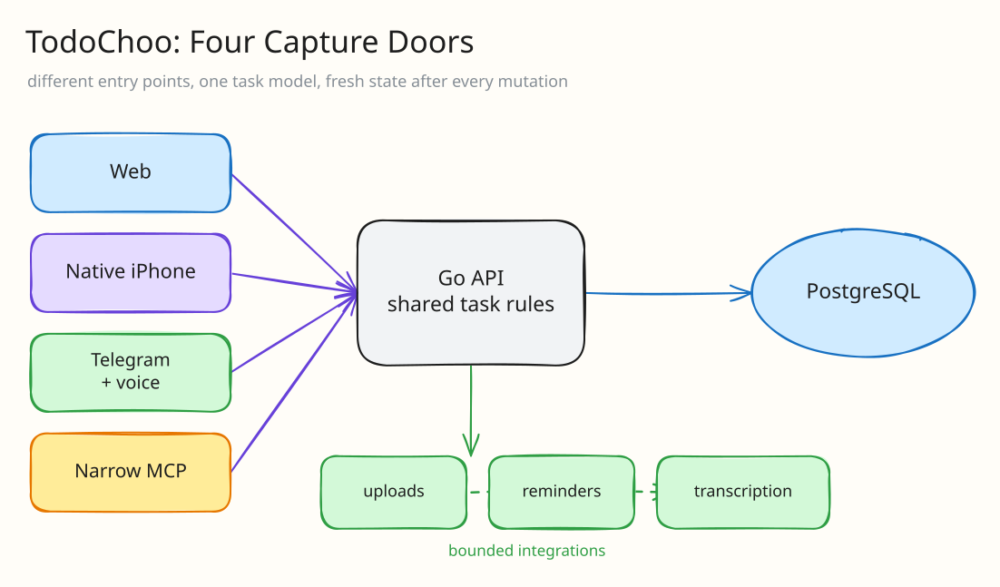

Every developer eventually makes a todo app.

Mine somehow ended up with a Go backend, TanStack Start, PostgreSQL, a Telegram bot, voice transcription, MCP, a native iOS app, offline reconciliation, attachments, recurrence, and way too many tests.

I called it **TodoChoo** because apparently I enjoy committing to a bit.

At first, this was just supposed to be a clean self-hosted task manager for myself. I wanted an inbox, Today and Upcoming views, projects, tags, recurring tasks, a calendar, and both list and Kanban layouts.

Once all of that existed, I kept thinking of new places where I wanted to create tasks.

That was the beginning of the problem.

Here is the real web client running against an isolated local account:



# Four doors into the same task

The web frontend uses TanStack Start, React, TypeScript, Zustand, and Tailwind. The backend is written in Go with `chi`, and PostgreSQL is the source of truth.



This is the organizing idea of the product: web, iPhone, Telegram, and Codex are not four partial databases. They are four doors into one task system.

## Door one: the web app

The web interface is the widest view. It is where I organize projects, switch between focused lists and Kanban, drag tasks on the calendar, manage tags and recurrence, and deal with attachments. It is the place for arranging work, not necessarily the fastest place to capture it.

The demo at the top shows this web client creating, filtering, completing, and reorganizing synthetic tasks.

The basic task features are:

1. Inbox, Today, Upcoming, Overdue, and Completed views
2. Projects and tags
3. List and Kanban layouts
4. Calendar views and drag-to-reschedule
5. Due dates, priorities, subtasks, and recurrence
6. Multiple image attachments
7. Import / export

Honestly, normal CRUD was not the hard part. The hard part was making all of the different clients agree on whether the CRUD actually happened.

# Door two: Telegram voice notes

Telegram quickly became one of my favorite ways to add a task because it is already open on my phone most of the time.

Plain text messages create tasks, but I also wanted voice notes for when typing is annoying. The backend downloads the recording into a private temporary directory, converts it into a predictable audio format, sends it to Groq's Whisper transcription endpoint, creates the task, and deletes the temporary audio.

The first demo was pretty easy. I sent a voice note and a task appeared. Yay!

Then came all of the less fun questions:

- What if Telegram sends the same update twice?
- What if the backend creates the task and dies before acknowledging it?
- What if two replicas start polling at the same time?
- What if the transcription is completely wrong?

I store Telegram update IDs transactionally so a redelivery does not create the same task twice. A PostgreSQL advisory lock ensures only one backend replica polls Telegram, while still allowing another replica to take over if the first one dies.

The task service returns whether this Telegram update actually created a row, so a replay can be acknowledged without duplicating the task:

```go
text, err := b.transcriber.Transcribe(ctx, outputPath)
if err != nil {
	b.send(tgbotapi.NewMessage(chatID, "I couldn’t transcribe that voice note. Please try again."))
	return
}

task, created, err := b.tasks.CreateFromTelegram(
	ctx, b.botID, updateID, userID, text,
)
if err != nil {
	b.send(tgbotapi.NewMessage(chatID, "I transcribed the note but couldn’t save the task. Please try again."))
	return
}
if !created {
	b.send(tgbotapi.NewMessage(chatID, "This voice note was already processed, so I didn’t create a duplicate."))
	return
}
b.sendTaskCreated(chatID, task)
```

`updateID` is part of the durable identity; the friendly duplicate message is backed by a database decision, not an in-memory guess.

Newly created tasks also get an Undo button. Voice capture should be fast, but it should not trap me with a task called “buy four fee filters” because Whisper had a rough day.

This was one of those features where the first 80% took a few hours and the last 20% became a distributed systems lecture.

# Door three: a deliberately narrow MCP

Of course, I also wanted Codex to create tasks.

TodoChoo has a small MCP endpoint which currently exposes a deliberately narrow tool surface for creating and listing tasks.

I made separate MCP credentials instead of reusing the normal web session token. The connection wizard shows the secret once, the backend only stores its hash, and the user can revoke it without logging out their browser or phone.

It would have been much easier to give the MCP client a normal API token and let it call everything. It also would have been a pretty bad security design.

I think AI integrations are much less scary when they are treated like a normal untrusted client with two explicit permissions instead of some magical superuser living inside the app.

# Door four: the native iPhone app

The native iOS app was where I started running into all of the state problems which the browser made easy to ignore.



What happens when the app launches offline? What if a task exists locally but the request never reached the server? What if the session expires while a cached dashboard is still visible? What if the app says the task changed but PostgreSQL disagrees?

I ended up making the client fetch fresh authoritative state after mutations instead of trusting the local success animation forever.



I also built reconciliation tests which repeatedly change server state and check that the client eventually matches it. One very important lesson was to inspect the actual Xcode test result for skipped tests.

I had a lovely green test run once where the live integration had silently skipped because the API environment variable never reached the test host. Technically green. Completely useless.

## Building a calm capture surface

The native app went through several rounds of mockups before I committed to a visual system: a near-black canvas, softly elevated cards, a violet action color, and native controls wherever iOS already had the right interaction.

The important decision was not the gradient. It was what **not** to put on the task list.

The main screen shows search, a tiny set of state filters, the tasks, and one obvious add action. Project, priority, schedule, notes, and recurrence live in the editor instead of becoming a row of permanent dashboard controls. The bottom navigation stays limited to Tasks, Calendar, Stats, and Settings because those are genuinely different destinations, not filters pretending to be navigation.

The task editor follows the same rule. The title and notes are available immediately. Schedule is explicit. Less common metadata sits behind **More details**, but the save action remains visible above the keyboard. I used native switches, pickers, tabs, and accessibility roles because a self-hosted app is not improved by inventing a worse date picker.

None of the polished surfaces are allowed to invent data. Empty metrics, fake streaks, and mockup-only progress numbers never enter the production app. If the API does not support a state yet, the UI does not cosplay as if it does.

That restraint helped more than adding another feature. The backend can be complicated without demanding that the task list feel complicated too.

# What every door has to admit

One of the smaller improvements was separating the Stats screen into:

1. loading
2. dependency failure
3. actual empty state

Previously, these could all become some form of “nothing here.” This is convenient for the code and incredibly confusing for the user.

An empty account should explain what will appear later. A failed request should show Retry. Loading should not flash an empty-state message for half a second.

I started applying this everywhere else too. An expired session is not a generic network error. A pending draft is not a confirmed task. A local image preview is not a durable attachment.

It turns out a lot of frontend polish is just being honest about which backend state you are currently in.

# An evidence board, not one green check

TodoChoo now has unit tests, API tests, browser tests, native simulator tests, and targeted product journeys.

I try to keep the evidence split by scenario because one gigantic end-to-end run is extremely annoying to debug. Auth, recurrence, Telegram, MCP, attachments, offline recovery, and native state should fail independently.

I also learnt not to “fix” every flaky local run by adding sleeps and retries. At one point I had Docker, Xcode, multiple simulators, and browser workers fighting on the same laptop. The machine was dying. Increasing every timeout would have made the tests slower without making the product better.

Sometimes the correct result is “the host was completely cooked, rerun this on a clean environment.”

# The finish line keeps moving

There are so many moments where I want to say the app is done:

- code compiles
- local tests pass
- GitHub Actions passes
- iOS simulator passes
- image is published
- production responds
- a real iPhone works
- a real Telegram voice note works
- someone besides me actually likes using it

These are unfortunately all different things.

TodoChoo made me much more careful about saying what was actually tested. Simulator success is not TestFlight. CI is not production. Production being up does not mean a customer outcome exists.

Very annoying, but probably good for me.

# The actual todo-app test

I understand why everyone builds a todo app now.

Tasks look simple, but they recur, move between projects, gain images, arrive from multiple clients, get edited offline, and need reminders at the correct local time. They are small enough that I can understand the whole product, but complicated enough to punish every bad assumption I make.

TodoChoo started as a CRUD app with a deliberately goofy name. It ended up teaching me a lot about auth, idempotency, distributed state, native clients, and actually testing product behavior.

I do also use it to remember what I need to buy from the grocery store, so I guess the core feature works too.
